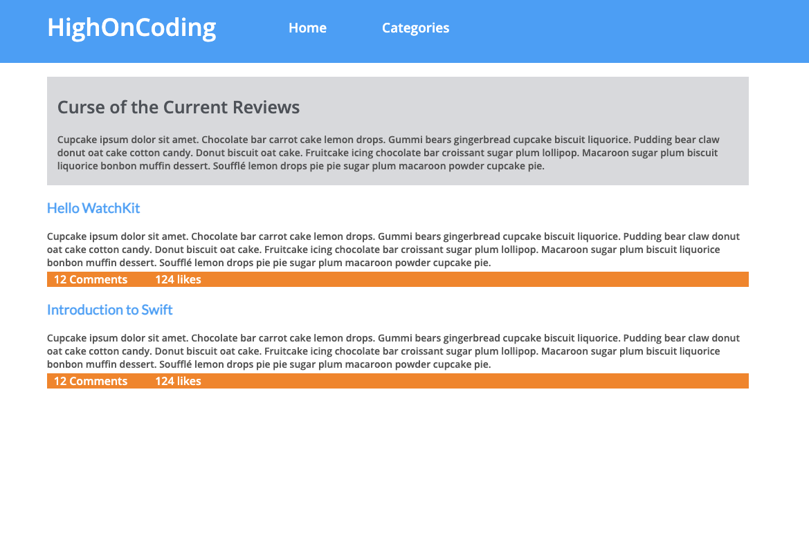

# Exercise: Build a Webpage Layout Using Just JS

## Challenge: 
Use JavaScript only to create a complete HighOnCoding webpage as shown below. Your HTML body should only have the following structure:

```HTML
<html>
  <head></head>
  <body>
    <div id="container"></div>
  </body>
</html>

```

## Result: 

